# pensamiento-compuatcional-sec-3
## sobre este respositorio
- Rogelio polesello (autor)  
- Obra     
- ¿Por qué elegi la obra?   
- Proceso    
- Resultado Final :D     

## Rogelio Polesello ##
  -Rogelio Polesello, nació el 26 de julio de 1939 en Buenos Aires, realizó grandes aportes a la abstracción geométrica en Argentina. Estudió en la Escuela Manuel Belgrano, y se graduó de profesor de dibujo, grabado y escultura en la Prilidiano Pueyrredón.    
  Artista que exploró la abstracción geométrica en pintura, grabado y objetos acrílicos con efectos ópticos. También incursionó en diseño, arquitectura y arte público, destacando por obras volumétricas y recargadas de geometría y color. Falleció en 2014 a los 74 años, dejando sus obras en buenas manos.   
 

**Sin titulo (1959) de Rogelio Polesello**  
Es una obra que explora la abstracción geométrica y el arte óptico. Mediante una trama de círculos y figuras de color, genera efectos visuales de movimiento y profundidad, centrados en la percepción más que en la representación.
   

  **¿Por qué fue elegida**
La elegí porque en ella se observa una interacción de formas geométricas y colores llamativos sobre un fondo cuadrado. Me llamaron especialmente la atención los colores de la obra, ya que el único elemento que se repite con mayor frecuencia es el círculo negro. Aun así, los cuadrados de colores y el triángulo del mismo tono que el fondo rompen con la linealidad presente en la composición, Aunque es curioso que no tenga un nombre pero la obra se representa mejor con su geometría que con un título. 

## Proceso ##  
empecé haciendo mi imagen de 400x 400 y con circulos de medidas 60x 60 pero me di cuenta que no me funcionaba ya que los circulos que debia poner les sobraba espacio y si agrandaba la circunferencia no iban a caer los circulos de  5x5 que estan presentes en la ilustracion asi que tuve q achicar el cuadrado en 300x 300  
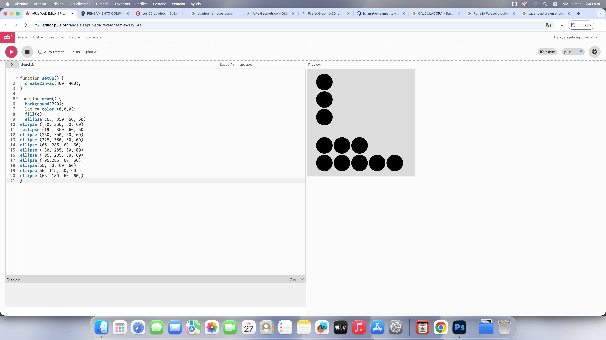

me di cuenta que en el de 300x 300 si hacia cuadrados de 50 iban a quedar muy apretados
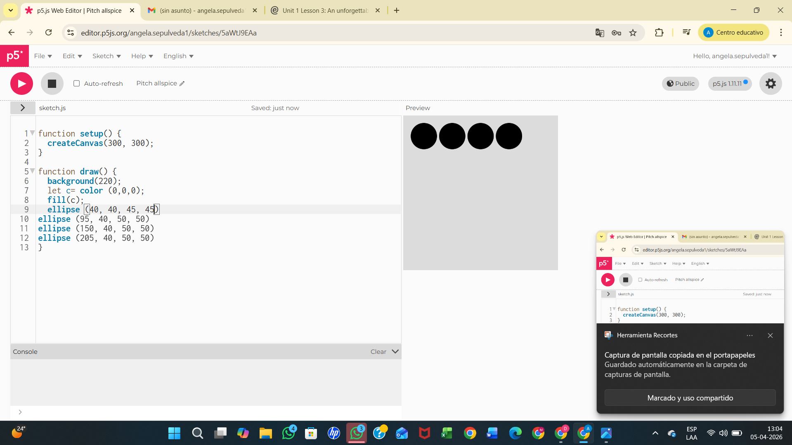

asi haré de 45 por 45, después que hice la pueba y saliera bien me di cuenta de la diferencia de margen de arriba y abajo
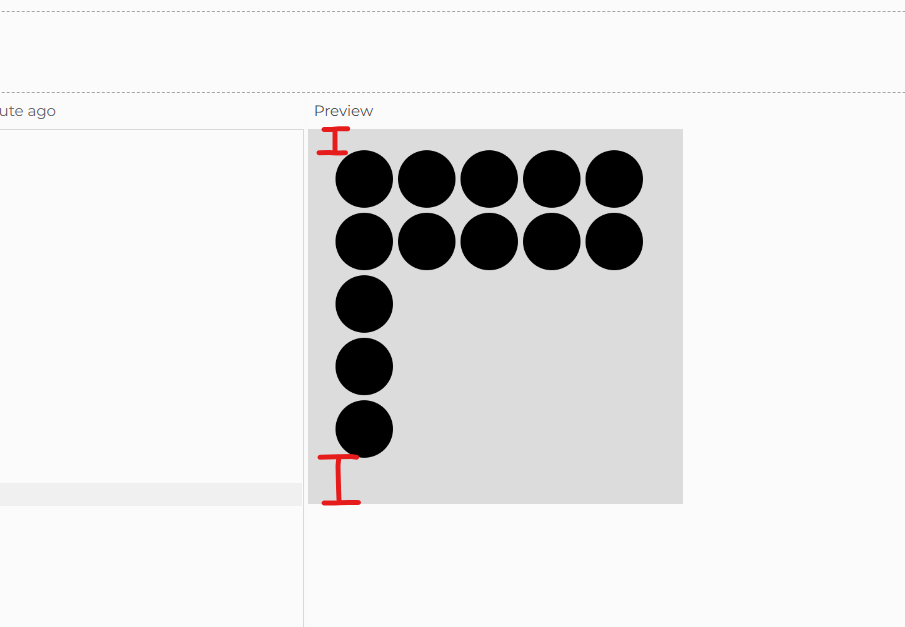

tambien me di cuenta q me equivoque en la figura (3, 4) ya que no le puse color pero le mande la imagen de referencia a una pagina llamada "image color picker" 
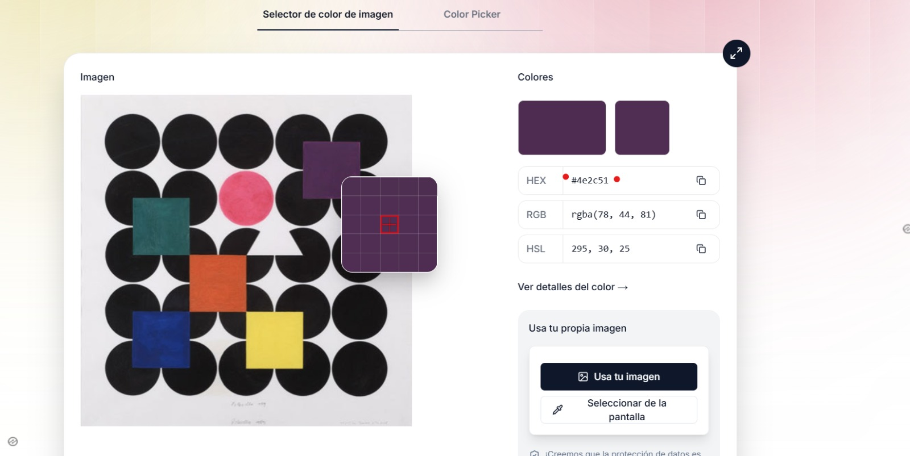

la cual me dio todos los colores presentes ahi, busque el del rosado y me dio el codigo #e35c7a y no sabia como ponerlo por lo cual busque y me di cuenta que solamente era poner el codigo 
let c1= color ('#e35c7a');   
  fill(c1);    
  noStroke();     
que era muy parecido al codigo q puse para hacer los circulos negros'
tuve q hacer el mismo procedimiento del circulo rosado con el cuadrado morado y lo comande como;
 let c3= color ('#4f2b51');
  fill (c3)
square (195, 50, 50)    
y así con los codigos que color que me daba la pagina agregaba un numero a c de manera secuencial y entre lineas 'el codigo de color'

 me di cuenta que la diferencia espacio de ancho eran mas grandes q la imagen original asi q los achique ej, el comado inicial era asi 
ellipse (145, 100, 45, 45) 
ellipse (141, 100, 45, 45)
 lo malo de esto es q se descuadro y tuve que poner el fondo gris para poder identificar en q me equivoque
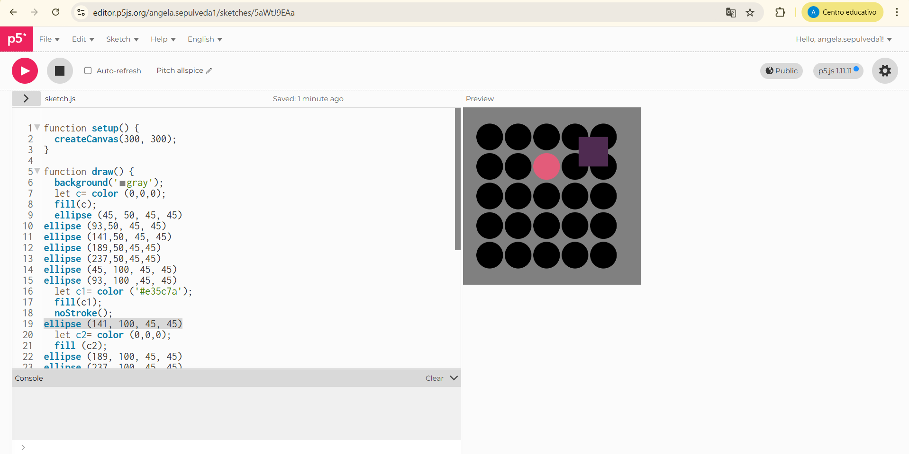

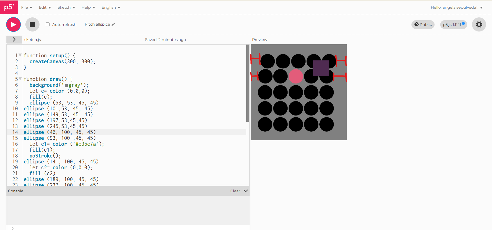
**(descuadre)**

para hacer el cuadrado morado lo tuve que hacer bajo prueba y error y a la primera quedo marcado, Luego para los siguientes cuadrados:        
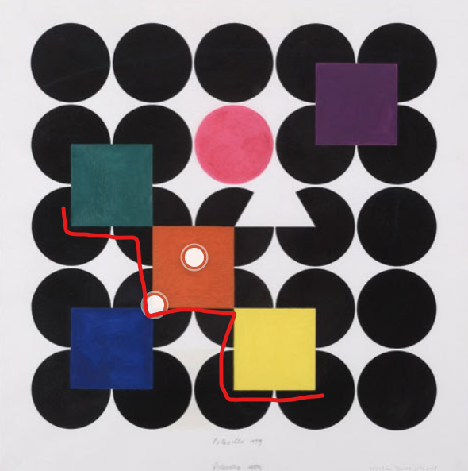
Fue sencillo después de haber sacado el primero ya que a las medidas del primero (no la última para q no afectara el tamaño del cuadrado) les iba agregando 50 q como se menciono anteriormente era el tamaño del cuadrado ej:      
**primer cuadrado:**   
let c4= color ('#306062')
  fill(c4);   
square (52,100, 50)    
**segundo cuadrado:**       
let c5= color ('#cc5a36')    
 fill (c5);     
square(102, 150, 50)     
**tercer cuadrado**        
let c6= color ('#ecd45a')      
  fill (c6);      
square( 152, 200, 50)    

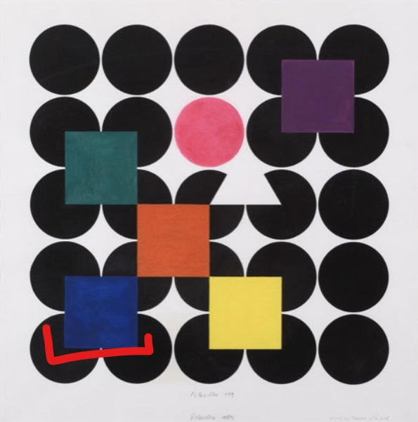         
**El cuarto** que es el azul aislado solo sume 100 a la "y" del cuadrado verde y la "x" la mantuve, quedando en:    
 let c7= color ('#1b2f78')    
  fill(c7);    
square (52, 200,50)    

Deje lo que para mi es más complicado que fue el triangulo teniendo en cuenta q es un dibujo en el plano cartesiano y no es como el cuadrado q para mi es más fácil poner x1,y1 y el tamaño de este último, hice mucha prueba y error guiandome de que punto comenzaban los cuadrados por ej el cuadrado naranjo tiene justo el mismo punto:   
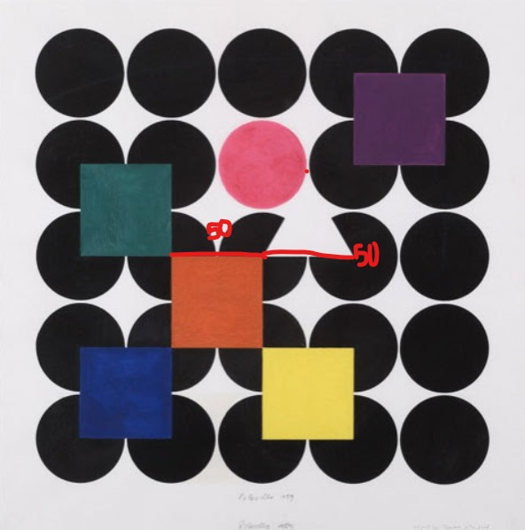 

así que lo unico que tuve que hacer es que al *codigo square(102, 150, 50)*, al 150 ponerle 50 (por el tamaño de los cuadrados), para hacer el otro punto tome en cuenta donde estaba la "y" y le sume 50 a la "x" quedando en (200, 151) y la punta tuve que hacerla más pequeña ya que en la imagen calcule y si lo hacia con altura de 50 iba a chocar con las otras formas cosa que no pasa en la ilustración así que la hice al ojo llegando a un resultado de (173, 105) y el código quedó así:
 let c8=color ('green')
  fill(c8);
triangle(150, 151, 200, 151, 173, 105);

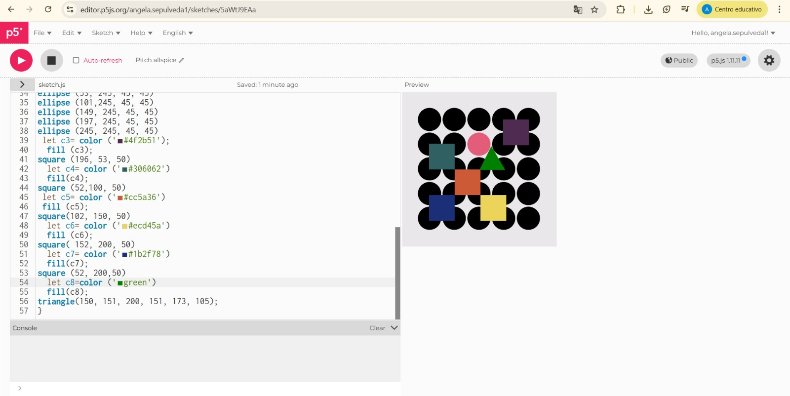  
(esta verde para demostrar con color como quedó) 

## Resultado final ##
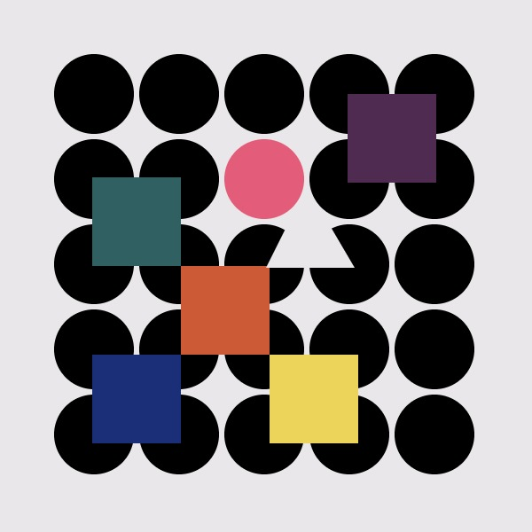 

Fue muy entretenido de hacer aunque admito que mi error fue no haberlo hecho con cuadricula ya que se me hubiese facilitado un poco más la prueba de error pero a la vez siento que eso me ayuda a practicar más. 

